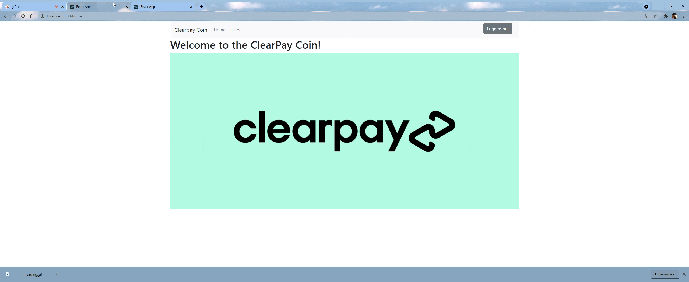
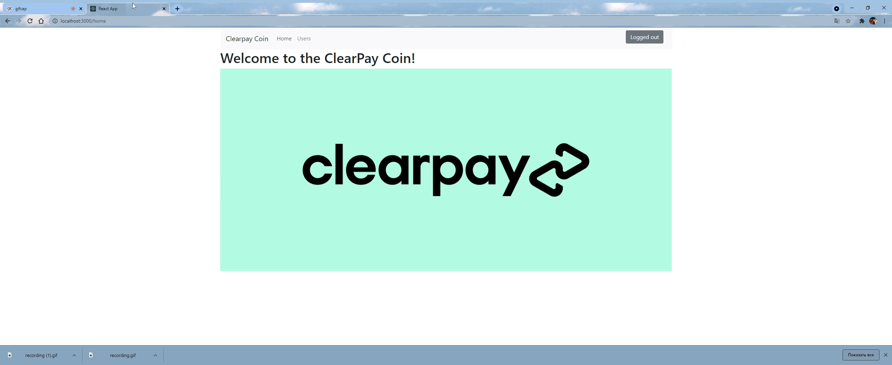

[](https://github.com/rudenko-clearpay/assignment/actions/workflows/build-artifacts.yml)
[](https://github.com/rudenko-clearpay/assignment/actions/workflows/build-artifacts.yml)

## Run within docker-compose:
```
1. docker-compose up
2. Open localhost:3000 in browser
```

## Run locally:
```
1. Install and run MongoDB locally
2. cd server
   mvn spring-boot:run -Dspring-boot.run.profiles=e2e-testing -f pom.xml
3. cd client 
   yarn
   yarn run start

```

## About
A web server application powered by Spring Boot on backend and ReactJS on frontend.  
The logic is that unless logged in, operator doesn't have access to transfers.  
There are two public pages: `Home` and `UsersList`, and a private `Transfer` page that is only available after "login".  
Operator can also do transfers from `Wallets`, he doesn't need to input source wallet ID in that case:

### UsersList page:  


### Transfer page:  


### Validation
There is a backend validation. In simpler cases it can match errors with fields that produce them: 
